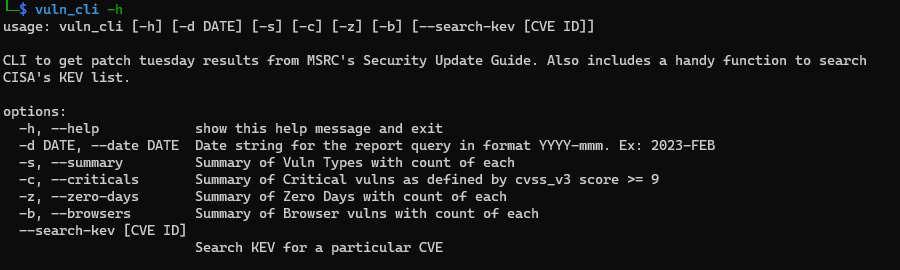
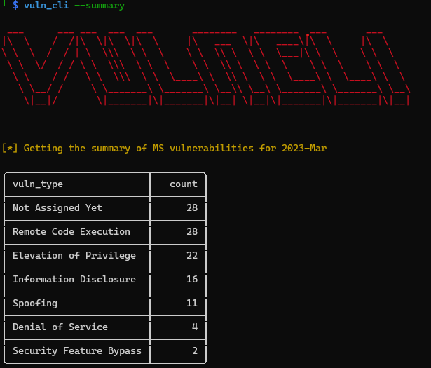

# vuln_cli
CLI tool to easily get Patch Tuesday results from Microsoft Security Response Center [Security Update Guide](https://msrc.microsoft.com/update-guide/vulnerability)

## Installation
- Clone this repo
- cd into the repo
- Run `pip install --editable .`

## Usage
The `--date, -d` flag will default to the current Year and Month if it is not specified unless it is currently between the 1st and the 2nd Tuesday of the month (Patch Tuesday) in which case it defaults to the previous month. There are cases where MS releases Edge updates in the above deadzone but this can be overridden by specifying the current month. Ex: `vuln_cli --browsers --date '2023-Apr'`

- Help
    - 

- Summary
    - Get a summary of vulnerability types (RCE,PrivEsc,etc...)
    - Run `vuln_cli --summary` or `vuln_cli -s`

